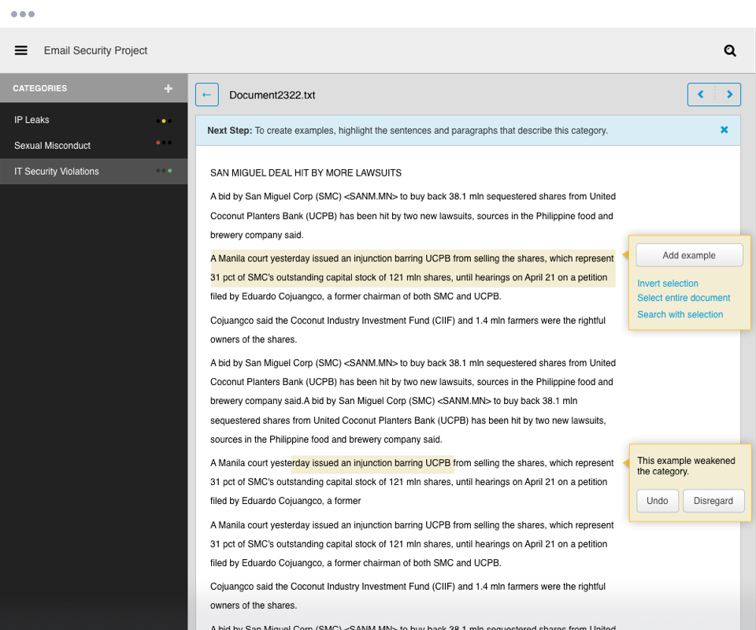

  

Content Analyst builds machine-learning software that automatically categorizes documents into conceptual topics defined by the user.

They contacted Viget to help envision and build a tool that would allow end users—patent examiners and intelligence analysts, for example—to train the software without the need for an information retrieval expert.

<figure>
  <figcaption>Collaborative sketching helped us explore concepts fast</figcaption>
  
</figure>

---

## Process
