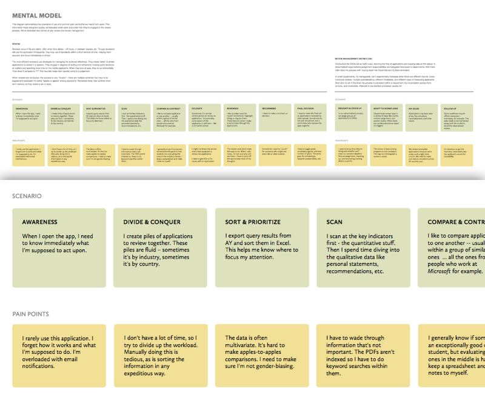
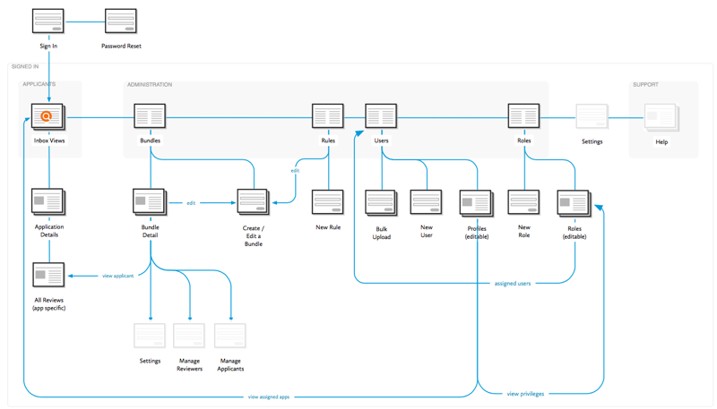

---

Hobsons is the leading provider of software for universities. Their flagship product, ApplyYourself, provides a way for prospective students to apply online. On the backend, the application is forwarded to an admission officer, who coordinates the review and final decision with faculty members.

Over time, the product managers noticed something interesting occurring: admission officers were sharing their login information with faculty members in order to manage the review entirely online.

ApplyYourself was never designed for faculty use, so that application was naturally ill-suited to their needs. But this security breech led them to investigate whether an online review tool for faulty would be valuable.

That's where myself and my team at Viget came in.

---

> We noticed users were sharing logins so that they could collaborate within the app. This signaled an opportunity to build a new application that fulfilled this need.

---

What first seemed to be a troubling security violation quickly turned into a strategic insight: there was hidden group of people using their software in ways never intended. If Hobsons could design a product unique to their needs, they'd gain a strong competitive advantage. We were brought in to plan and design this app.

---

I used annotated greyboxes to describe the underlying patterns that were shared across screens.

Microinteractions were illustrated in detail to ensure a clean handoff to the client's developers.

---

We discovered that the review process involved a lot of choreography among different people.

I distilled the scenarios of use and pain points into a mental model. The common activities were captured in a sequence diagram that shows the flow of data among different people. Having the client participate in these sessions increased efficiency and contributed to a shared understanding of the problem.

---

## Additional Artifacts

### Mental Model

After synthesizing user research into common trends, I communicated the insights in a mental model. The top level (green) offered common mental states while the bottom delineated pain points. 

We later used this framework to determine which features to build.

### Sitemap

---

## Credits

| ------ | ----- |
| <strong>Agency</strong> | Viget |
| <strong>Visual Design</strong> | Mark Steinruck |
| <strong>Front End Dev</strong> | Jeremy Frank | 
| <strong>Project Management</strong> | Kevin Powers | 
