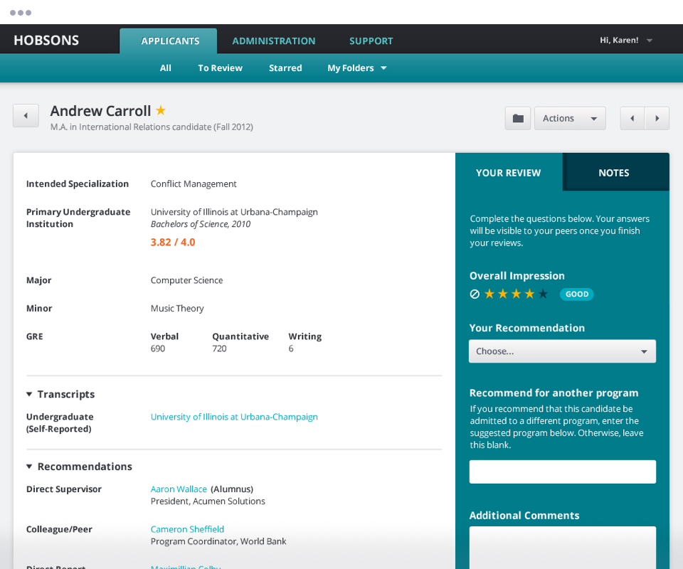
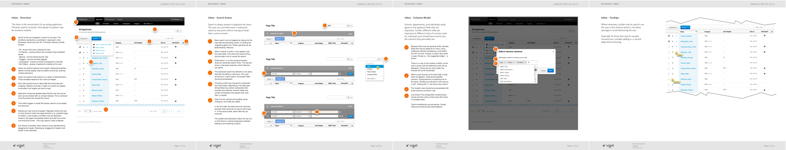

  

A leaked password ignited an idea for a new application.

Hobsons provides university admissions departments the tools to accept and manage applications submitted by prospective students. Their flagship software, ApplyYourself is in use by a large fraction of undergraduate and graduate schools.

ApplyYourself was designed for admissions officers, who manually distributed the applications to faculty reviewers. Soon, these officers were sharing their passwords with reviewers to streamline the process. Hobsons noticed this behavior and found a unmet need for an efficient application review tool.

That's when they contacted us.

---

<h2>Responsibilities</h2>

  <ul>
    <li>User Research</li>
    <li>Product Design</li>
    <li>Interface Design</li>
    <li>Prototyping</li>
    <li>Usability Testing</li>
  </ul>

---

## Process

After conducting user research, I distilled the findings into a mental model. It identifies the major and minor tasks that users encounter, their pain points, and their coping strategies. This helped us determine where we needed features to fill gaps. It also helped us identify places where fewer features would be acceptable.

<figure class="full-bleed">
  <figcaption>Mental model</figcaption>
  
</figure>

While each school had a unique review process, some elements were similar. To help us understand the "common denominator" of activities, I created collaboration diagram. It distills the common activities and handoffs among different people in a review.

<figure>
  <figcaption>Collaboration diagram</figcaption>
  
</figure>

I started the design phase by identifying the views and flows. While describing scope, it was a useful planning tool: our sprints mapped to discrete sections of the site.

<figure>
  <figcaption>Sitemap</figcaption>
  
</figure>

Early, we explored building a workflow engine that would route applications automatically. We visualized how this could work, which allowed us to quickly determine that this complex feature would have only limited value. It was easy, therefore, to postpone this feature for a later release.

<figure>
  <figcaption>Workflow diagram</figcaption>
  
</figure>

We allowed extra time to deliver a fully annotated deck of wireframes. This captured the details Hobsons and Viget had hashed out together over the previous weeks.

<figure>
  <figcaption>Annotated wireframes</figcaption>
  
</figure>

We illustrated the micro-interactions that occur on page widgets. This was essential for conveying details to Hobsons' development team.

<figure>
  <figcaption>Microinteractions</figcaption>
  
</figure>

After everything was vetted and agreed-to, I documented the system in detail. Providing formal annotated wireframes was essential since their team was charged with building the application after my engagement finished.

<figure class="full-bleed">
  <figcaption>Annotated wireframe samples</figcaption>
  
</figure>

---

We discovered that the review process involved a lot of choreography among different people.

I distilled the scenarios of use and pain points into a mental model. The common activities were captured in a sequence diagram that shows the flow of data among different people. Having the client participate in these sessions increased efficiency and contributed to a shared understanding of the problem.

## Credits

| ------ | ----- |
| <strong>Agency</strong> | Viget |
| <strong>Visual Design</strong> | Mark Steinruck |
| <strong>Front End Dev</strong> | Jeremy Frank |
| <strong>Project Management</strong> | Kevin Powers |
