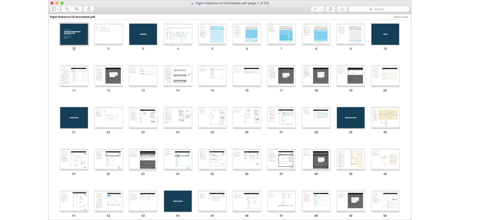
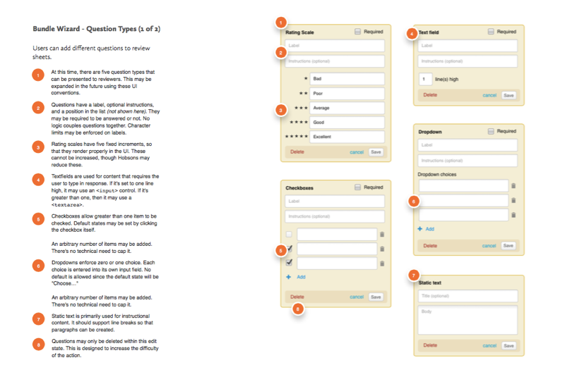

  

Hobsons is the leading provider of software for universities. Their flagship product, ApplyYourself, provides a way for prospective students to apply online. On the backend, the application is forwarded to an admission officer, who coordinates the review and final decision with faculty members.

Over time, the product managers noticed something interesting occurring: admission officers were sharing their login information with faculty members in order to manage the review entirely online.

ApplyYourself was never designed for faculty use, so that application was naturally ill-suited to their needs. But this security breech led them to investigate whether an online review tool for faulty would be valuable.

That's where myself and my team at Viget came in.

---

<h2>Responsibilities</h2>

  <ul>
    <li>User Research</li>
    <li>Product Design</li>
    <li>Interface Design</li>
    <li>Prototyping</li>
    <li>Usability Testing</li>
  </ul>

---

## Process

We started the project off with user research. I communicated the interview findings using a mental model. The top level (green) offered common mental states while the bottom delineated pain points. We later used this diagram to determine which features to build.

  

I started the design phase by identifying the views and flows. While describing scope, it was a useful planning tool: our sprints mapped to discrete sections of the site.

  

After everything was vetted and agreed-to, I documented the system in detail. Providing formal annotated wireframes was essential since their team was charged with building the appplication after my engagement finished.

  

<figure>
  <figcaption>Detail of annotated wireframe</figcaption>
  
</figure>

---

We discovered that the review process involved a lot of choreography among different people.

I distilled the scenarios of use and pain points into a mental model. The common activities were captured in a sequence diagram that shows the flow of data among different people. Having the client participate in these sessions increased efficiency and contributed to a shared understanding of the problem.

## Credits

| ------ | ----- |
| <strong>Agency</strong> | Viget |
| <strong>Visual Design</strong> | Mark Steinruck |
| <strong>Front End Dev</strong> | Jeremy Frank |
| <strong>Project Management</strong> | Kevin Powers |
