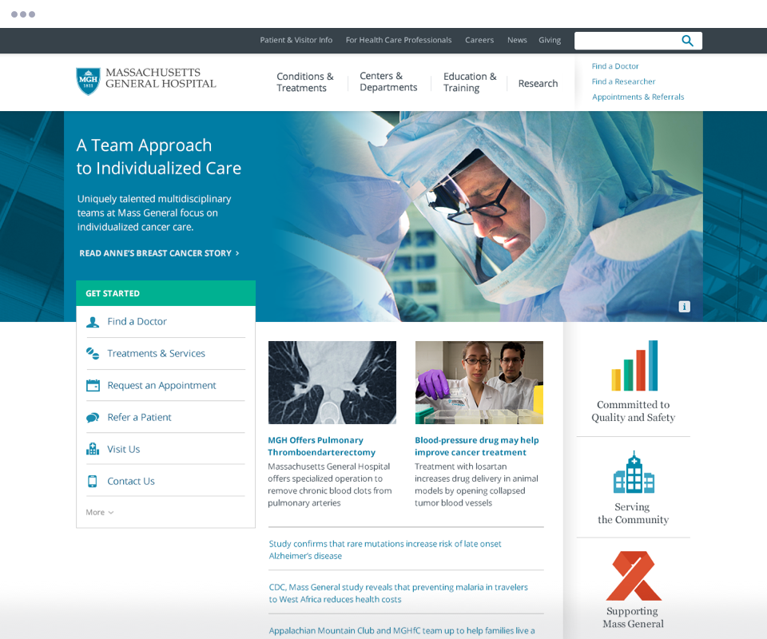

  

---
<figure class="full-bleed">
  <figcaption>The situation analysis mixed traffic analytics with a heuristic review. It identified significant observable problems on the current site. A few sample images are shown.</figcaption>
  
</figure>

<figure>
  <figcaption>In addition to auditing URLs, I also catalogued all templates in use.</figcaption>
  
</figure>

<figure>
  <figcaption>Understanding the database model for the current CMS was essential.</figcaption>
  
</figure>

<figure class="full-bleed">
  <figcaption>Using a website for documentation was better than managing PDF documentation.</figcaption>
  
</figure>

<figure>
  <figcaption>Each center is like its own microsite. A condensed header provided access to the main Mass General navigation.</figcaption>
  
</figure>

<figure>
  <figcaption>Within pages, subtemplates were needed to present a wide range of content effectively.</figcaption>
  
</figure>

<figure>
  <figcaption>The system had to support existing customizations made by the Departments.</figcaption>
  
</figure>

The CMS offered limited control over images and it wasn't feasible to ask _all_ editors to crop images. Most images, as a result, use common camera aspect ratios.

<figure>
  <figcaption>Department homepage.</figcaption>
  
</figure>

I was also able to use a small Rails app that I built in my free time. Switchman lets you create shareable URLs that redirect users to multiple tests dynamically. <a href="https://medium.com/todd-moy/building-switchman-6a2bdb640c04">Read more</a>.

<figure>
  <figcaption>Switchman.</figcaption>
  
</figure>
