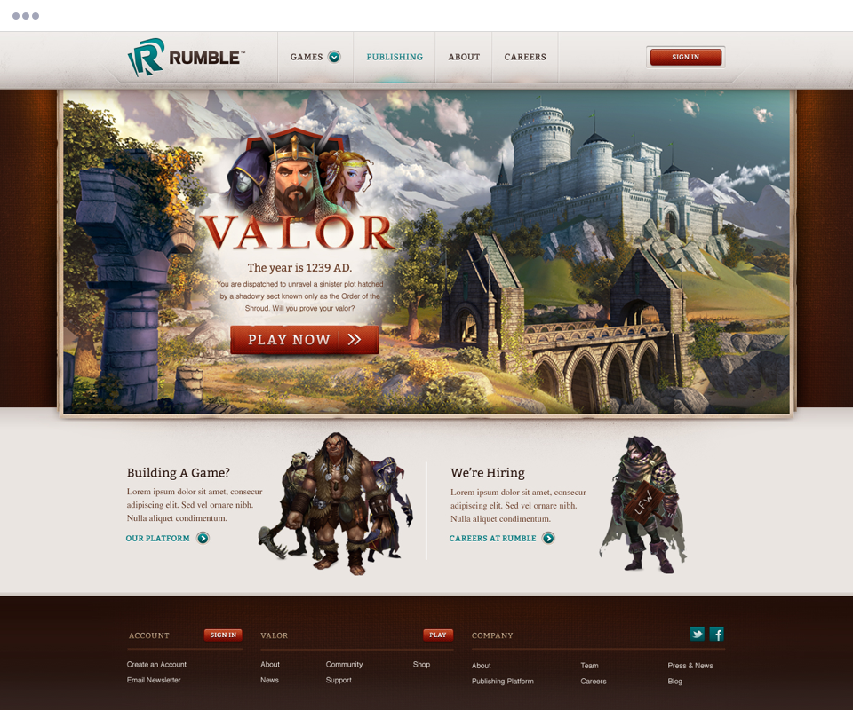

  

Rumble Games is an up-and-coming publisher focused on becoming the leading online developer of premium quality, free-to-play games. Backed in part by Google Ventures and led by an executive team with 70+ years of industry experience, Rumble's promise to shake up the gaming industry was incentive enough for Viget to help the start-up make its introduction to the world.

---

<h2>Responsibilities</h2>

  <ul>
    <li>Interface Design</li>
    <li>Info Architecture</li>
    <li>Content Strategy</li>
  </ul>

---

The site information architecture needed to support games in different stages of maturity. Some may be accessible only to invited beta testers while others are open for all. Our IA allows each game's content and functionality to evolve as it progresses from a teaser to a fully operational game.

<figure>
  <figcaption>Sitemap</figcaption>
  
</figure>

The homepage balances the need to introduce Rumble Games, the company, with the need to introduce their game titles. The new layout promotes the newest game, while still allowing users easy access to existing games, support, and community forums

<figure>
  <figcaption>Homepage wireframe</figcaption>
  
</figure>

The game page is the landing page for an individual title. It tells the story of the game - its characters and its features, and offers users multiple actions (play, interact, learn).

<figure>
  <figcaption>Game page wireframe</figcaption>
  
</figure>

The navigation offers a flexible, scalable structure that can grow as Rumble adds new titles. The navigation has multiple states, depending on whether or not a user is logged in to the Rumble system.

<figure>
  <figcaption>Navigation example</figcaption>
  
</figure>
