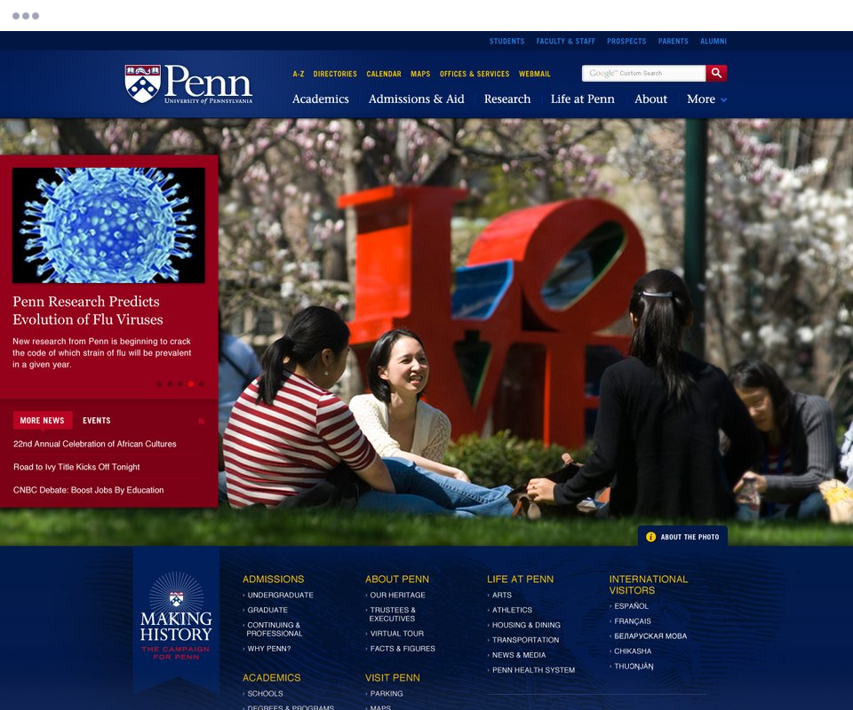
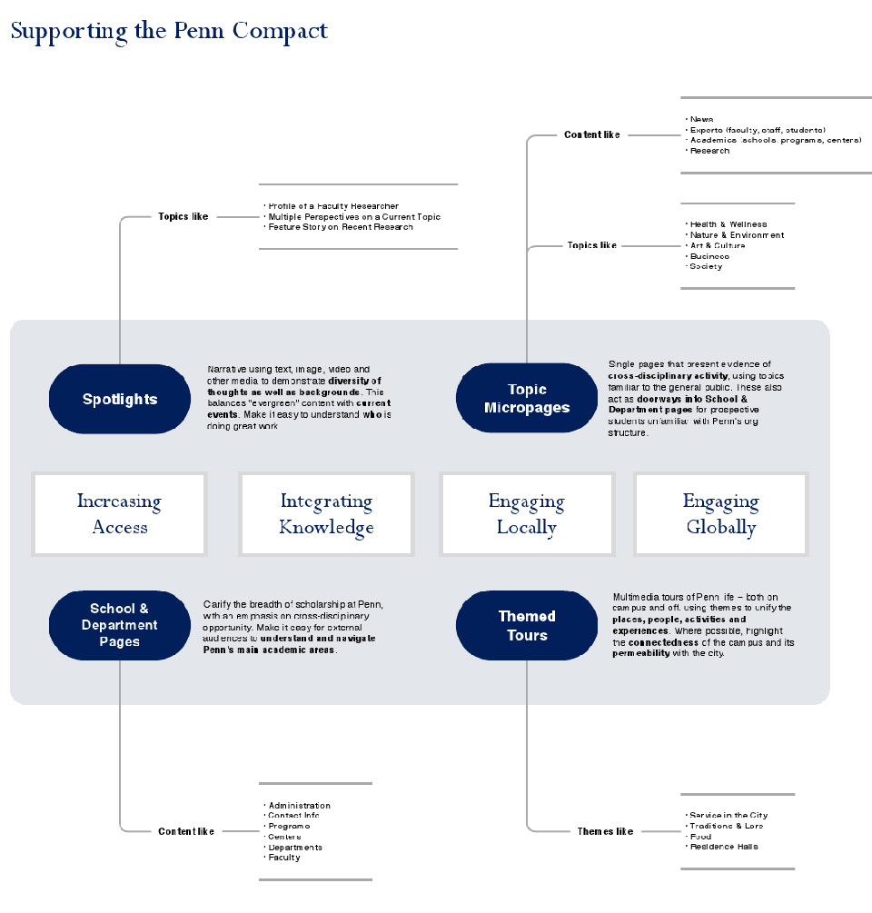
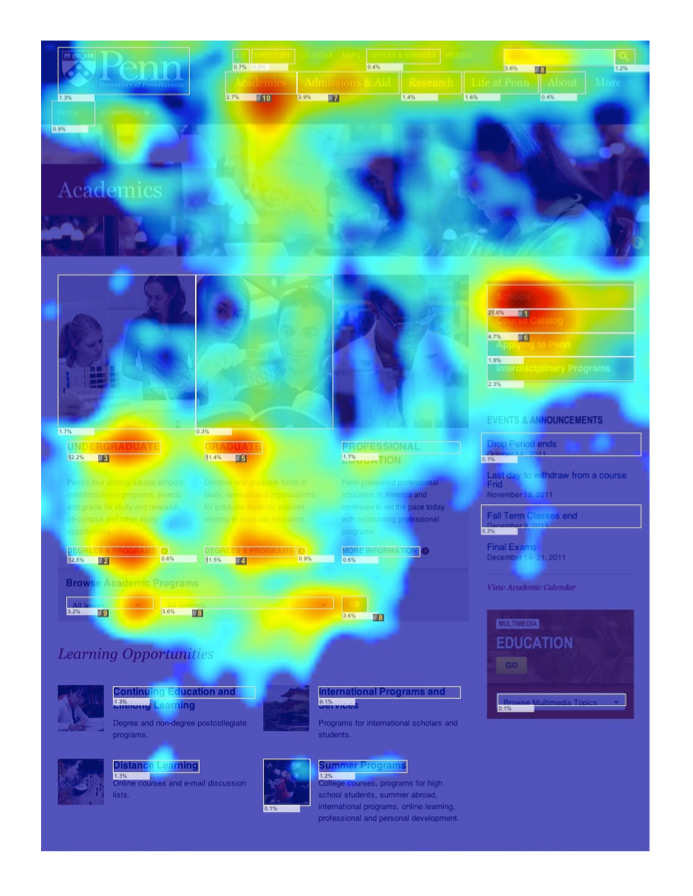

  

The University of Pennsylvania’s main site, upenn.edu, had evolved over many years with little oversight to the total user experience. As a result, there were a large number of pages that were informally linked together. Navigating through them was slow and often challenging.

For Penn, we conducted interviews with key users of the site: current students, prospects, parents, faculty and staff. We also conducted formative card sort testing on their current IA to pinpoint the trouble spots. This allowed us to focus our attention on the poorly performing areas while retaining those areas that worked well.

With a shortlist of goals, we redesigned the interface to make it faster for users to find the key information they needed. We also designed new sections of the site that would highlight the campus experience for new users.

---

Before redesigning the information architecture, we first wanted to determine which parts weren’t performing well. To do this, we used Treejack, an IA testing tool.

In this test, we chose a sample of content that lived in various places on the site. Users then clicked through a mock IA, ultimately picking one spot where they thought the content would be found. This gave us quantitative data on how usable the current IA was, which allowed us to focus our effort on the rough spots.

<figure>
  <figcaption>Examples of Task Performance</figcaption>
  
</figure>

Many stakeholders and users requested content and features for the new site. While this input is valuable, we chose to think first about what users needed to accomplish. This mental model matches features and content to users’ tasks and mindsets. This approach helped ensure we could trace our designs back to needs and goals, rather than fads and technology.

<figure>
  <figcaption>Name</figcaption>
  
</figure>

After launch, we ran the heatmapping tool ClickTale again to validate the site’s performance. This showed us where users engaged—and what they ignored. Generally speaking, we saw greater engagement across the site and less use of “crutches” like Search and A-Z index. We did, however, find other content that could be given more prominence within the site. For these, we provided recommendations on small tweaks that would improve the site’s usability.

<figure>
  <figcaption>Clicktale heatmap of the Academics Page</figcaption>
  
</figure>
